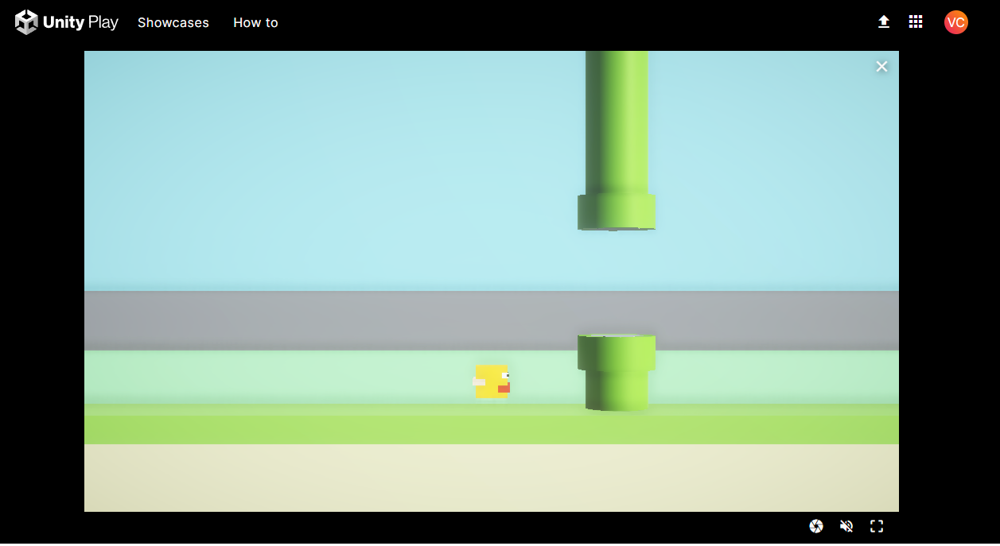

# flappybird_basics

Recriação do flappybird para efeitos didáticos, seguindo as aulas da formação de desenvolvedor de jogos Unity na DIO.

Link do jogo na plataforma WebGL
https://play.unity.com/mg/other/webgl-builds-388724

### Produto desenvolvido
* Recriação dos assets com componentes primitivos tridimensionais
* Movimentação de Personagem
* Spawn e destruição de obstáculos
* Detecção de colisão
* Score e fim de jogo
* Reinício do jogo 5 segundos após game over

### Backlog do projeto para momento futuro
* UI para mostrar score e salvar último score
* Tela inicial para escolher dificuldade
* Incluir sonoplastia
* Gerar executável para plataforma windows